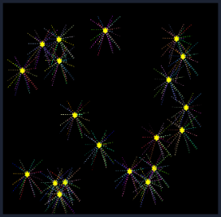
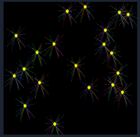
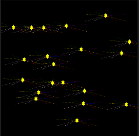
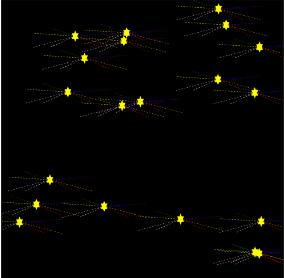

# Trabalho Haskell 2022B
Created by GitHub Classroom

### _Identificação da dupla:_

- Felipe Sanfelice e Giovanni Cacioli.

### _Exemplos de imagens de saída - Fogos de artifício:_

- Java:

 

- Haskell:

 

### _Como executar o programa:_

- Java: abra o console na pasta do arquivo e digite "**javac [nome do arquivo].js**". Logo após, rode ele digitando "**java [nome do arquivo]**".

- Haskell: abra o console na pasta do arquivo e digite "**ghci [nome do arquivo].hs**". Logo após, rode ele digitando " **Main**" ou neste caso o nome da função principal que é a primeira a ser chamada.

### _Análise comparativa dos códigos:_

  São duas linguagens totalmente distintas, uma imperativa e a outra declarativa. Utilizam dois paradigmas diferentes: Programação Funcional / Programação Orientada a Objetos (pode-se utilizar outros, mas são os mais marcantes em Java e Haskell, respectivamente). Embora elas tenham essas diferenças, enquanto fazíamos o trabalho em ambas as linguagens, percebemos que a lógica de programação nos auxilia a compreendê-las menos como "linguagens distintas", ou seja, uma quebra de paradigmas… risos.

  Para começar, se faz necessário destacar a diferença mais marcante – a **estrutura do código** em si. Isto se evidencia pelas funções bem separadas em Haskell que em Java não existem, o todo é executado na função Main.

  Observando apenas as partes do código que montam o nosso fogo de artifício, em Java foi possível, com poucas linhas de código e sem muita complexidade, desenhar as linhas pontilhadas em volta da estrela utilizando funções matemáticas que posicionam elas no raio com espaçamento padrão. Porém em Haskell, a solução encontrada e aplicada foi fazer uma função mais elaborada utilizando um vetor para as cores, juntamente com outras funções para replicar as linhas pontilhadas (tivemos mais dificuldade). Principalmente no laço de repetição em Haskell, enquanto em Java foi fácil, na outra linguagem fazer a mesma coisa se tornou um objetivo muito complicado.

  Agora abordando semelhanças, para gerar os números aleatórios em Java utilizou-se a função Rand. A forma como é instanciada a função que gera números randômicos não difere muito de Haskell. Em uma, é instanciado o objeto Random para utilizar seus métodos, e na outra chamamos a função diretamente sem instanciar objeto algum, afinal estamos lidando com o paradigma funcional. Porém a lógica para a utilização é a mesma, e foi a mesma em quase todo o decorrer do código.

### Créditos para sites/pessoas que ajudaram:

- Sites:
  - Stackoverflow
  - W3big
  - Devmedia
  - hackage.haskell.org

- Vídeos:
  - [https://www.youtube.com/watch?v=TqLtexmxdko&list=PLYItvall0TqJ25sVTLcMhxsE0Hci58mpQ&index=19](https://www.youtube.com/watch?v=TqLtexmxdko&list=PLYItvall0TqJ25sVTLcMhxsE0Hci58mpQ&index=19)
  - [https://www.youtube.com/watch?v=emFMHH2Bfvo](https://www.youtube.com/watch?v=emFMHH2Bfvo)
